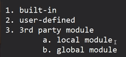

* Day_11
  - 

* Echma Script for importing modules:
  -  It has introduced a new syntax for requiring any module using import statement

* import vs require
  - require includes all the functionalities of a module inside project
  - import only includes the needed functionalities from a module inside a project

* There are two conventions/types for writing js code:
  - Common JS
  - ES(Ecma Script)

* import is a convention of ES
* require is from common JS

* Syntax for import statement:
  - *import {a, b} from module-path*
  - e.g. utility.js-> sum, square
  - e.g. *import { sum } from "./utility.js"*

* ByDefault node js works on common js standards, so that's why we can't use import statement

* To use standard of ES in node js include "type": "module", in package.js 

```JS
export const sum = (a, b) =>{
    return a+b;
}

export const square = (n)=>{
    return n*n;
}

export const PI = 3.14
```
```JS
import { sum, square } from "./utility.js";

import util from "./utility.js" //import whole module inside util variable

const x = sum(3, 5);
const y = square(4);
console.log(x);
console.log(y);
```

```JS

var myData = [];

//operations or calculations

myData.push(10);
myData.push(20);
myData.push(30);


export default myData;

// if any module has to export a single pproperty and that too after performing certain operations/calculations (not immediately at the time of declaration)
// for the above case, we have to use export default
```
* types of modules
  - built-in
  - user-defined
  - 3rd party modules: manual installation 
     * npm install module-nmae/package-name *for installation*
     * npm uninstall module-name/package-name *for uninstallation*
     * npm install module-name@version *for specific version*
* Whenever we install any 3rd party module in the pproject, npm will keep all the files and folders for that newly installed module into node_modules folder. And also it will maintain its record into package-lock.json and package.json

* When we install any dependency then its record will be there in package.json file

* Why do we need to have the name of dependecies into package.json file?
  - to let entire team know what dependency and what version of it we are using
  - due to larger size of node_module (files and folders) it is not ideal thing to move the node_modules folder if needed, so instead move/transfer entire project folder other than node_modules. Now into the new location/new system, just simply run npm install command and it will look into package.json file and will install all the dependencies mentioned in it.



* We have two types of 3rd party modules
  1. local module: module installed inside of a specific project 
     - if any module is providing a predefined code base int the form of functions, classes, constants then we must install it locally
     - only local module record will be there in package.json file 
     - only local module can be referred as dependency
     - npm install module-name --save / npm i module-name --save *makes sure that the record of installed package is mentioned in dependency of package.json*
  2. global module: module installed globally at the installation location of node js in the system, and we can use it across the project
     - if any module is providing a tool then we should install it globally so that all the projects can utilize it 
     - npm install module-name --global/npm isntall module-name -g/npm install -g/--global module-name *for installing module global* 

* Express JS
   - npm install express
