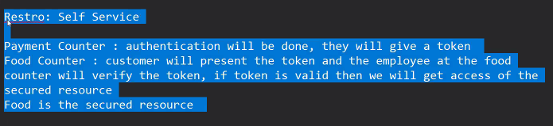

* Day_13
   - 

* As of now, all the API's are open for all i.e any one is this world who is having the url they can access the API but this should not happen ideally 

* In order to prevent above behaviour, we need to add authentication to the API's

* Flow
  - Admin Registration
  - Admin login
  - Now, all the secure API's should verify first that if admin has logged in or not
  - if admin is logged in then only API should do its job
  - other is admin is not logged in then respond with error message

* Login API:
  1. Receive username and password from requested body
  2. Match the username and password given by user in the request with the db values
  *select * from admin where username=${request.body.username} and password=${request.body.password};*
  3. after matching into to db:
     - username and password matched-> *generate a token and send it in respone login is successful and user is valid*
     - username and password didn't matched-> *responf with error message like username or password*
  
* Secured API:
  1. first the secured api will recevie the token on the request
  2. secured API now should verify thr token 
  3. if token is invalid then API will do its job
     . if token is invalid or there is no token in the request then respond with error message  

* For authentication purpose we will use JWT Token 

* At the time of token generation we have to decide that what data we should contain inside a token with the help of json object

* To generate a token we also need a secure key

* var dataForToken = {
   userId: 101
}

* client app-> request-> login api
* login api-> response { token: "ey........."}-> client app
* client app-> save token in browser memory
* client app-> request-> pass token in the request for secure api->
  secured api-> verify the token -> if token is verified-> proceed to the API Job
* request header: meta data for the request token
* We have to pass the token in the request header of any secured api 

* Middleware:
  - Read Authorization 
    "Bearer eyyyeiue....."
  - if Authorization header is not passed in the request: respond with an error message like token is missing
  - if Authorization header is passed in the request: read the token value 
  - Verify the token
     * if token is valid: next();
     * if token is invalid: respond with error message 