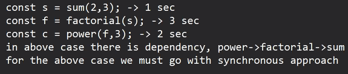

* Day_5
  - 
* for array: 
  - filter: it will filter the elements based on user defined conditions
  
```JS
var arr = [10, 20, 30, 40 , 50];
var newArr = [];

for(i=0; i<arr.length; i++){
    newArr.push(arr[i]+2);
}

console.log(newArr);
```
* map: if we want to get a new array by updating each and every element of the current array.

```JS
var arr = [10, 20, 30, 40, 50];

var newArr = arr.map(value=>value + 2);

console.log(newArr)

```
* foreach: it will do tracersing on the array and in each iteration it will give you each element of arry one by one

```JS
   var arr = [10, 20, 30, 40, 50];

arr.forEach((value, index)=>{
    console.log(value+" at "+index);
}); 
```
```JS
    var a1 = [10, 20, 30, 40, 50];
    var a2 = [11, 12, 13, 14];
    var a3 = a1.concat(a2);
    console.log(a3);
```
* In JS one operator is there i.e spread operator (...)
  - it is used to spread / unbox the elements of an array into another array
  - spread operator works for JSON objects also.

```JS
    var a1 = [10, 20, 30, 40, 50];
    var a2 = [11, 12, 13, 14];
    var a3 = [a1, a2]; //2d array
    console.log(a3);
```
```JS
    var a1 = [10, 20, 30, 40, 50];
    var a2 = [11, 12, 13, 14];
    var a3 = [...a1, a2]; //unboxing array a1
    console.log(a3);
    var a3 = [...a1,...a2]; //unboxing array a1 and a2
    console.log(a3);
```
```JS
var studentName = "Aniket"
var obj = {name: studentName, marks: 56};
console.log(obj);
```
* if we want to consider the variable name as the key
  - //{studentName:"Aniket"}
  - in below case the variable name itself will be treated as key name
```JS
var studentName = "Aniket"
var studentMarks = 56;
var obj = {studentName, studentMarks};
console.log(obj);
```
```JS
var o1 ={
    name:"Suresh",
    age:25
};

var o2 ={
    email: "suresh@mail.com",
    phone: "999111"
};

var o3 ={o1, o2};  //{o1:{}, o2:{}};

o3 = {...o1, ...o2}; //unboxing o1, o2
```
* if we want to consider the value of a variable as the key name
```JS
var x = "studentName";
var obj={[x]: 'Mohit'}; //{studentName:'Mohit'}
console.log(obj);
```
* Types of process in JS:
  - Synchronous: 
    * blocking nature, till the first task is not completed, the next task will not be started
    * next task has to wait to start its execution until the first one has completed its job
   
    p1->2sec
    p2->3sec
    p3->2sec
  
  - Asynchronous:
    * non-blocking nature
    * with the help of callback function we can make any task asynchronous
    * 

```JS
function sum(a, b){
    console.log("sum is:"+(a+b));
}

function cube(a){
    console.log("cube is:"+(a*a*a));
}

sum(3, 5);
cube(4);
```

* setTimeout(callback, milli-sec, arguments of callback); this function will delay the execution of any taask by mentioned amount of time

* callback functions never getting called immediately when we pass them into argumnet

```JS
function sum(a, b){
    console.log("sum is:"+(a+b));
}

function cube(a){
    console.log("cube is:"+(a*a*a));
}

sum(3, 5);
cube(4);

setTimeout(()=>{
    console.log("Hello");
}, 2000);

console.log("After setTimeout");
/*
After setTimeout
Hello
*/

setTimeout((arg)=>{
    console.log(arg);
}, 2000, "bye");

console.log("After setTimeout");
/*
After setTimeout
bye
*/

setTimeout(sum, 2000, 2, 3);
console.log("After setTimeout");
/*
After setTimeout
5
*/
```
```JS
function sum(a, b){
    console.log("sum is:"+(a+b));
}

function cube(a){
    console.log("cube is:"+(a*a*a));
}

setTimeout(cube, 2000, 6);
setTimeout(sum, 1000, 2, 3);
console.log("After all the operations");
/*
After all the operations
5
72
*/
```
```JS
setTimeout((a, b)=>{
    var c = a+b;
    console.log("sum is:"+(a+b));
    
    setTimeout(()=>{
    console.log("cube is:"+(c*c*c));
}, 1000);

}, 2000, 2, 3);

console.log("After all the operations");
/*
After all the operations
sum is:5
cube is:125
*/
```
* use case: if multiple async operations are there, but we want to execute them synchronously then we have to go in nested of the callback

* sum 1sec -> factorial 3sec -> power 1.5sec

```JS
console.log("Calc sum..");
setTimeout((a, b)=>{
    var c = a+b;
    console.log("sum:"+c);

    console.log("Calc Factorial..");
    setTimeout(()=>{
        let n = c; 
        let f = 1;
        for(i=1; i<n; i--){
            f = f * n;
        }
        console.log("factorial: "+f);

        console.log("Calc Square..");
        setTimeout(()=>{

            console.log("power:"+(f*f*f))
        }, 1500)
    }, 3000)
}, 1000, 2, 3)
```
* nesting of callback functions is callback hell
* We should always avoid callback hell
  - Why?->
  - bad readability
  - maintenance of the code will become difficult

* Promise:
  - Promise in JS used to work same as of real life

  - For any of the task first create a promise
  - Then till the task has not executed, we can say promise is neither fullfilled nor rejected but it will remain in the pending state
  - Now the promised task will be executed 
  - and once the execution has been done, then Promise will either fullfill or rejected
  - in case of successful execution of tasks: fullfilled
  - in case of failure/error: rejected
  - Now next on the basis of promise state we have to take several actions