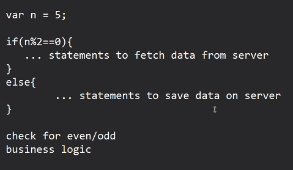

* Day_6
  - 


* Promise:
* Steps for working with Promise:
  1. Create a new Promise, then write logic it, based on the task we have to resolve or reject the promise and its mandatory because if we don't resolve or reject then promise will remain in pending state

  * Promise will have 3 states:
    - Pending
    - Resolved/fullfilled
    - Rejected 
  
  2. Execute the promise task

  3. Handle the promise:
     - Based on the promise state, we can take certain actions
     - To Handle the promise JS has given two functions
       * then()
       * catch()


* Syntax to create a promise:

```JS
const myPromise = new Promise((resolve, reject)=>{
        //statements;
        if(succeeded){
                resolve();  // function for success
        }else{
            reject();  // funtion for reject
        }
  }); 
```
- e.g: Check if any given number is even or odd based on the type of number we have to perform a different task.
- if number is even: fetch data from server
- if number is odd: save data on a server  


```JS
var n = 8;
const evenPromise = new Promise((resolve, reject)=>{
        if(n%2 === 0){
            resolve();
        }else{
            reject();
        }
})
```
* To handle the promise we should call then() & catch() functions on Promise Object

```JS
var n = 8;
const evenPromise = new Promise((resolve, reject)=>{
        if(n%2 === 0){
            resolve();
        }else{
            reject();
        }
});

evenPromise
.then(()=>{
    console.log("Fetching data from server");
}).catch(()=>{
    console.log("save data on a server");
});
```
* Passing arguments
```JS
var n = 8;
const evenPromise = new Promise((resolve, reject)=>{
        var data = [10, 20, 30, 40];
        if(n%2 === 0){
            resolve(data);
        }else{
            const error = new Error("No. not divisible by 2");
            reject(error);
        }
});

evenPromise
.then((data)=>{
    console.log(data);
    console.log("Fetching data from server");
}).catch((error)=>{
    console.log(error);
    console.log("save data on a server");
});
```
* Wrapping Promise inside a function
```JS
function checkEvenPromise(n){
const evenPromise = new Promise((resolve, reject)=>{
        var data = [10, 20, 30, 40];
        if(n%2 === 0){
            resolve(data);
        }else{
            const error = new Error("No. not divisible by 2");
            reject(error);
        }
});
return evenPromise;
}

const x = checkEvenPromise(4);

x
.then((data)=>{
    console.log(data);
    console.log("Fetching data from server");
}).catch((error)=>{
    console.log(error);
    console.log("save data on a server");
});
```
* 
```JS

function sum(a, b){
    return new Promise((resolve, reject)=>{
        setTimeout(()=>{
            var c = a+b;
            if(c){
                resolve(c)
            }else{
                reject("Error: Sum cannot be calculated")
            }

        }, 1000);
    }); 
}

function factorial(n){
        return new Promise((resolve, reject)=>{
            setTimeout(()=>{
               
                if(n){
                     var fact=1;
                for(i = 0 ; i<=n; i++){
                    fact = fact*i;
                    }
                    resolve(fact);
                }else{
                    reject("Error: Factorial cannot be calculated")
                }
            }, 3000)
        })

}

function square(n, p){
    return new Promise((resolve, reject)=>{
        setTimeout(()=>{
            var sq = n*n;
            if(sq){
                resolve(sq);
            }else{
                reject("Error: Square cannot be calculted");
            }
        }, 1500);
    });
}

sum(2, 3).then((sumResult)=>{
        console.log(sumResult);
})
.catch((error)=>{
    console.log(error);
})

square(5).then((sqResult)=>{
    console.log(sqResult);
})
.catch((error)=>{
    console.log(error);
})

factorial(6).then((fact)=>{
    console.log(fact);
})
.catch((error)=>{
    console.log(error);
})
```