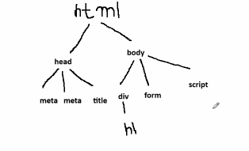

* Day_7
  - 

* Destructuring an object:
  - const student = {
    roll: 145, 
    name: "Anuj",
    marks: 96
  }
  - for accessing rollno = student.roll
  - for accessing name = student.name
  - we can take out individual key out from json object, and the keyname will be treated as an individual variable
  - Destructuring means, we are extracting out the keys

```JS
const student = {
    roll: 145, 
    name: "Anuj",
    marks: 96
  }
const { roll, name, marks } = student;
console.log(roll);
console.log(name);
console.log(marks);
```
* DOM Manipulation
  - DOM: Document Object Model
  - 
  - Whenever any html page loads in the browser, so first of all browser will create a tree like structure/model that will be containing hierarchy of the tags and the same structure/model is known as DOM
  - By reading the same model, the browser decides like which element is parent and which element is child  
  - Once web page has been loaded into the browser, so DOM structure will be created already
  - Now if we are modifying the already created DOM then we can it as DOM Manipulation

* What we can do with DOM manipulation
  1. we can introduce a new element in the DOM
  2. we can remove any existing element also
  3. we can modify the style
  4. we can change the content of any element
  5. we can get the constent of any element
  6. we can get the value of attributes
  7. we can change the value of attributes 

* document: this object represents the DOM tree structure
* Note: We need to get the object of that element on which operation has to be performed

* How to get object of html elements in JS?
  - JS has certain predefinedd functions, which are used to get the object reference of the elements
  - var myObj = document.getElementById(id); -> returns single element
  - var elements = document.getElementsByClassName(className) -> returns multiple elements
  - var tags = documnet.getElementsByTagName(tagName); -> returns multiple elements based on tag name
  - var obj = document.querySelector("#id" || ".class" || "tag"); ->  
```html
    <html>
        <head>
            <title>page</title>
        </head>
        <body>
            <div>
                <h1></h1>
            </div>
            
            <form></form>
            <script></script>
        </body>
    </html>
```
```html
    <html>
        <head>
            <title>page</title>
        </head>
        <body>
            <input type="button" value="Click Me" onclick="showAlert();">
            <script>
                function showAlert(){
                    alert("button clicked!!")
                }
            </script>
        </body>
    </html>
```
```html
    <html>
        <head>
            <title>page</title>
        </head>
        <body>
            <input type="button" value="Click Me" id="btn">
            <script>
                var myButton = document.getElementById("btn");
                console.log(myButton);
                // element.eventname = function(){
                
                //}

                myButton.onclick = function(){
                    alert("hello world");
                }
            </script>
        </body>
    </html>
```
* get the content
```html
    <html>
        <head>
            <title>page</title>
        </head>
        <body>
            <h1 id="heading">Hello World</h1>
            <input type="button" value="Click Me" onclick="operation()">
            <script>
               function operation(){    
                var h1Element = document.getElementById("heading"); // will give the object of th tag 
                console.log(h1Element); // display the complete element
                console.log(h1Element.innerHTML); // innerHTML will give the content return inside of the tag
               }

            </script>
        </body>
    </html>
```
* update the content 
```html
    <html>
        <head>
            <title>page</title>
        </head>
        <body>
            <h1 id="heading">Hello World</h1>
            <input type="button" value="Click Me" onclick="operation()">
            <script>
               function operation(){    
                var h1Element = document.getElementById("heading"); // will give the object of th tag 
                console.log(h1Element); // display the complete element
                h1Element.innerHTML = "This is new content";
               }

            </script>
        </body>
    </html>
```
* remove element 
```html
    <html>
        <head>
            <title>page</title>
        </head>
        <body>
            <h1 id="heading">Hello World</h1>
            <input type="button" value="Click Me" onclick="operation()">
            <script>
               function operation(){    
                var h1Element = document.getElementById("heading"); // will give the object of th tag 
                h1Element.remove();
               }

            </script>
        </body>
    </html>
```
* insert element
```html
    <html>
        <head>
            <title>page</title>
        </head>
        <body>
            <h1 id="heading">Hello World</h1>
            <div id="container"></div>
            <input type="button" value="Click Me" onclick="operation()">
            <script>
               function operation(){    
                   var element =  document.createElement("h2");
                   element.innerHTML = "This is a new Heading";
                   var containerDiv = documnet.getElementById("container");
                   containerDiv.appendChild(element);
               }

            </script>
        </body>
    </html>
```
* dealing with attributes
```html
    <html>
        <head>
            <title>page</title>
        </head>
        <body>
            <a href="https://www.google.com" id="link">Follow this link</a>
            <button onclick="operation();">Change Link</button>
            <script>
               function operation(){    
                  var linkElement = document.getElementById("link");_
                  var value = linkElement.getAttribute("href");//read the value of attribute
                  console.log(value);
                  //linkElement.setAttribute(name, value);
                  linkElement.setAttribute("href", "https://www.flipkart.com");
               }

           
```
* task turn bulb on & off using DOM
```html
```
* Password show/hide
```html
    <html>
        <head>
            <title>page</title>
        </head>
        <body>
            <input type="password" placeholder="Enter Password" id="passwordField">
            <button onclick="togglePassword();" id="btn">Show</button>
            <script>
              
              function togglePassword(){
                var pass = document.getElementById("passwordField");
                var button = document.getElementById("btn");
                if(button.innerHTML === "Show"){
                    pass.setAttribute("type", "text");
                    button.innerHTML = "Hide";
                }else{
                    pass.setAttribute("type", "password");
                    button.innerHTML = "Show";
                }
                
              } 
     </script>
        </body>
    </html>
```

* Change the style using DOM
```html
 <html>
        <head>
            <title>page</title>
        </head>
        <body>
            <h1 id="heading">This is heading</h1>
            <button id="btn" onclick="toggleVisiblity()">Hide</button>
            <script>
                function toggleVisiblity(){
                    var heading = documnet.getElementById("heading");
                    var btn = documnet.getElementById("btn");
                    //Camel casing
                    if(btn.innerHTML === "Hide"){
                    heading.style.display= "none";
                    btn.innerHTML = "Show";
                    }else{
                        heading.style.display= "block";
                        btn.innerHTML = "Hide";
                    }

                }
            </script>
        </body>
    </html>
```

* Read an input value
```html
 <html>
        <head>
            <title>page</title>
        </head>
        <body>
            <input type="text" placeholder="Enter value" id="text">
            <button id="btn" onclick="getValue()">Get Value </button>
            <script>
               function getValue(){
                    var field = document.getElementById("text");
                    console.log(field.value); 
               }
            
            </script>
        </body>
    </html>
```
* Calculator
```html
 <html>
        <head>
            <title>page</title>
        </head>
        <body>
            <input type="text" placeholder="Enter 1st value" id="n1">
            <br><br>
            <input type="text" placeholder="Enter 2nd value" id="n2">
            <br><br>
            <button id="btn" onclick="sum()">Sum</button>
            <h3 id="sum"></h3>
            <script>
               function sum(){
                    var c = parseInt(document.getElementById("n1").value) + 
                    parseInt(document.getElementById("n2").value);
                    document.getElementById("sum").innerHTML = "Sum is:"+c;
               }
            
            </script>
        </body>
    </html>
```
* validating input text
```html
 <html>
        <head>
            <title>page</title>
        </head>
        <body>
            <input type="text" placeholder="Enter value" id="text">
            <br><br>
            <button id="btn" onclick="validate()">Validate Text</button>
            <h3 id="sum"></h3>
            <script>
               function validate(){
                    //atleast 4 chars are there
                    var textField = document.getElementById("text");
                    var text = textField.value;

                    if(text.length >= 4 ){
                        textField.style.borderColor = "green";
                    }else{
                        textField.style.borderColor = "red";
                    }
               }
            
            </script>
        </body>
    </html>
```
* Form validation
```html
 <html>
        <head>
            <title>page</title>
        </head>
        <body>
            <form action="https://www.google.com" onsubmit="return validate()">
            <input type="text" placeholder="Enter name" id="name">
            <br><br>
            <input type="email" placeholder="Enter email" id="email">
            <br><br>
            <input type="password" placeholder="Enter password" id="password">
            <br><br>
            <input type="text" placeholder="Confirm password" id="confirm-password">
            <br><br>
            <select id="qualification">
                <option  value="">-----Select Qualification------</option>
                <option value="Btech">Btech</option>
                <option value="Mtech">Mtech</option>
                <option value="bsc">BSC</option>
                </select>
                <br><br>
                <input type="radio"  name="gender" id="maleRb"><label>Male</label>
                <input type="radio" name="gender" id="femaleRb"><label>Female</label>
                <br><br>
                <input type="checkbox" id="termCb"><label>I accept terms and condition</label><br><br>
            <button id="btn" type="submit">Register</button>
            <h3 id="sum"></h3>
            </form>
            <script>
               function validate(){
                    return true;
               }
            
            </script>
        </body>
    </html>
```
