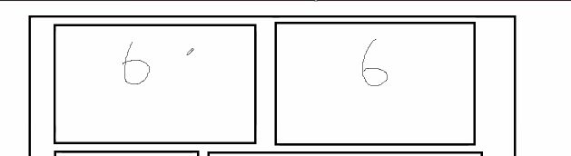
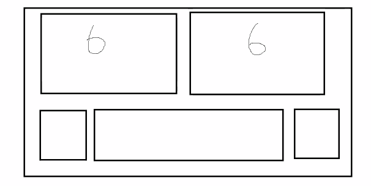
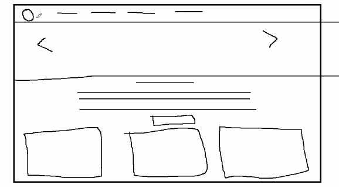

* Day_8
    - 
* tbody -> append tr -> append td
```html

<body>
    <button onclick="populateTable()">Fetch Data</button>
    <table border="1" cellpadding="10" cellspacing="0">
        <thead>
            <th>Id</th>
            <th>Name</th>
            <th>Gender</th>
            <th>Phone</th>
        </thead>
        <tbody id="row-container">
            
        </tbody>
    </table>

    <script>
        function populateTable(){
            var usersData = [{
                id: 111,
                name: 'Sohan',
                age:26,
                gender: 'male',
                phone: 98384348

            },
            {
                id: 112,
                name: 'Rohan',
                age:25,
                gender: 'male',
                phone: 98343848

            },
            {
                id: 113,
                name: 'Mohan',
                age:22,
                gender: 'male',
                phone: 98323848

            },
            {
                id: 115,
                name: 'Priya',
                age:22,
                gender: 'female',
                phone: 2383848

            },
            {
                id: 118,
                name: 'Roshni',
                age:27,
                gender: 'female',
                phone: 983438

            }];

            usersData.forEach((user)=>{
                const {id, name, age, gender, phone} = user;
                var tableRow = document.createElement('tr');
                var idColumn = document.createElement('td');
                var nameColumn = document.createElement('td');
                var ageColumn = document.createElement('td');
                var genderColumn = document.createElement('td');
                var phoneColumn = document.createElement('td');

                idColumn.innerHTML = id;
                nameColumn.innerHTML = name;
                ageColumn.innerHTML = age;
                genderColumn.innerHTML = gender;
                phoneColumn.innerHTML = phone;

                tableRow.appendChild(idColumn);
                tableRow.appendChild(nameColumn);
                tableRow.appendChild(ageColumn);
                tableRow.appendChild(genderColumn);
                tableRow.appendChild(phoneColumn);

                document.getElementById('row-container').appendChild(tableRow)
            })


        }   
    </script>
</body>

```

* Bootstrap
  - UI library that will make a page responsive
  - Responsive: A page that will adjust its layout according to size of screen  
  - Without bootstrap it is possible to make a page responsive, but for that we need to write a large amount of css media queries
  - In bootstrap lots of media query is already written, it also provide few UI components

* How bootstrap makes our page responsive:
  - Bootstrap breaks down the entire width into 12 equal sections/grids/columns - *Grid System*
  - Bootstrap css provides already created class selectors, we just have to apply those classes onto the html elements

* Creating two sections

  - the class="col" will assign the equal amount of width to all the divs 
  - col-n  to define how many columns does the div wants to occupy. 
  n -> 1 to 12

```html
<div class="row">
    <div class="col"></div>
    <div class="col"></div>
</div>
```
```html
<div class="row">
    <div class="col-4"></div>
    <div class="col-8"></div>
</div>
```

```html
<div class="row">
    <div class="col-2"></div>
    <div class="col-8"></div>
    <div class="col-2"></div>
</div>
```
* Building a web page using bootstrap
  - structure:
    


* Jquery:
  - It is a library built on the top of js, jquery ease out the JS development by providing predefined functions.
  - To get object of an element
* $(selector);
    - with id: $("#name");
    - with class: $(".name"); // array 
    - with tag: $("name"); // array 

* events:
  - onclick-> click
  - onkeyup -. keyup;
  - $(selector).event-name(call-back function);

* e.g.
```js
id = "btn"
$(document).ready(()=>{
$('#btn').click(()=>{
    alert("Hello");
});
})
```