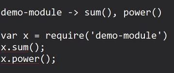

* Day_9
    - 

* AJAX
  - Asynchronous JavaScript and XML
  - Is used to send request on a server and get response from it
  - Is Async that means, it will not block other process
  - It will not reload the browser during the req and resp process
  - AJAX is used to send req on server and get resp without blocking the other process and also without reloading the browser

* Steps:
  1. We have to create an object of XMLHttpRequest 
     - var xhr = new XMLHttpRequest();
  2. We have to initialize the request. Mention the url and request method using which req has to be sent
       - xhr.open(method, url);
  3. Send the Request
     - xhr.send();
  4. Read the response
     - To read the response we need to chexh the state of the request
     - During the entire ajax process, browser maintains an integer flag
     - With each step of ajax, integer flag changes its value
     - readyState is the name of that flag
     - readyState -> 0 to 4
     - 0 -> new XMLHttpRequest object has been created
     - 1 -> request has been opened (open() has been called)
     - 2 -> request has been sent
     - 3 -> Server has accepted the request
     - 4 -> Server has sent the response, response is ready at the client side
     - Whenever ready state changes, it will fire an event ( onreadystatechange )
* JSON.parse(data) will convert JSON string to JSON object 

* fetch(url) is the abstraction of XMLHttpRequest();

```JS
var xhr = new XMLHttpRequest();
xhr.open("GET", "www.jsonplaceholder.typicode.com/users");
xhr.send();
xhr.onreadystatechange = ()=>{
    if(xhr.readyState === 4 && xhr.status === 200){
        var users = JSON.parse(xhr.responseText);
        console.log(users);
    }
}
```
```JS
async function fetchData(){
try{
    const res = await fetch("www.jsonplaceholder.typicode.com/users");
    console.log(res);
    const users = await res.json();
    console.log(users);
}catch(error){
    console.log(error);
}
}
```

* API: 
  - Application Programming Interface
  - API is a way to use functionalities/features/services of one app into another app
  
* Types of API's
  - Desktop/Standalone APIs: given by native OS
  - Web APIs: running on a server, to access them we need to send req on url and we will get response

* OOP in JS
```JS

class Employee{
    constructor(){
        console.log("Employee created");
        this.id = 100;
        this.name = "Lawrence";
    }
}

var emp = new Employee();
console.log(emp);
console.log(emp.id, emp.name)
```

```JS

class Employee{
    constructor(id, name){
        console.log("Employee created");
        this.id = id;
        this.name = name;
    }

    show(){
        console.log(this.id, this.name);
    }
}

var emp = new Employee(101, "Lawrence");
console.log(emp);
console.log(emp.id, emp.name)
emp.show();
```
* Inheritance in JS

```JS
class Animal{
    speak(){

    }
}

class Dog extends Animal{
    speak(){
        console.log("bhow bhow")
    }
}
```
- ES is standard 
- JS is implemention of ES

```JS
var obj = {
    x: "Hello",
    y: function(){
     console.log(this) //current JSON object assigned in obj  
    }
}

obj.y();
```

```JS
var obj = {
    x: "Hello",
    y: ()=>{
     console.log(this) //refer to window object 
    }
}

obj.y();
```

* Node JS:
  - Node js os not a language, not a library
  - Node js is a runtime environment for JS
  - using Node JS, we can execute js code as a standaloe application

* Module: bundle that will properties, functions, classes, contants

* Types of modules:
    1. Pre-defined: The modules which are already developed and provided by node JS

    2. User-defined: module created by a developer

* Pre-defined modules: 
  - File handling: node js provides a module with name 'fs', which has functions to perform operations on a file
  
  
* fs -> writeFile, readFile
```JS
const fs = require('fs');
fs.writeFile();
fs.readFile();
```

```JS
const fs = require('fs');
fs.writeFile("my-notes.txt", "This is text data", ()=>{
    console.log("File created");
});
```
*Synchronously
```JS
const fs = require('fs');
fs.writeFileSync("my-notes.txt", "This is text data");
```